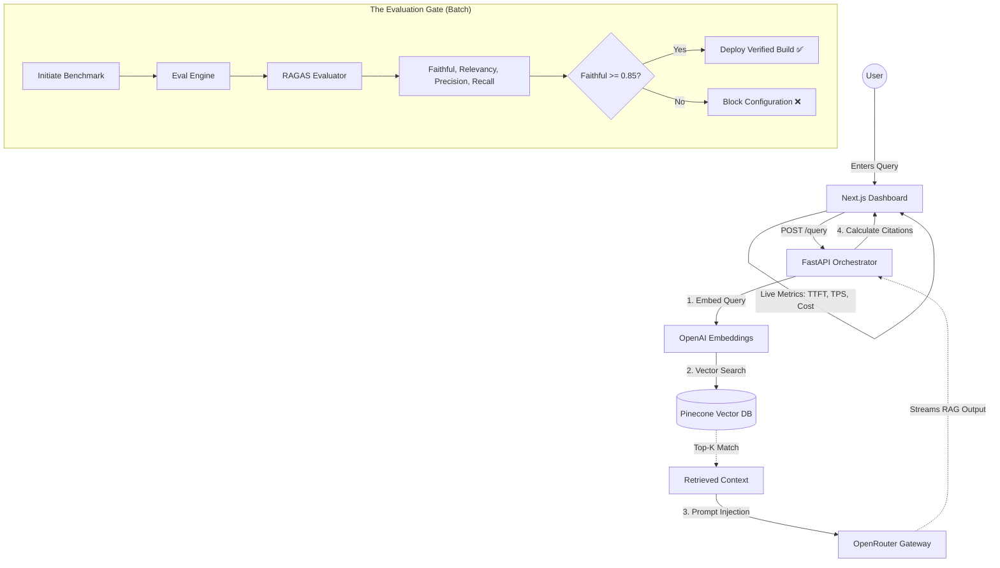

# Eval-Gated Observable RAG (Production-Ready)

This project provides an **Evaluation-Gated** RAG architecture designed to bridge the gap between raw LLM outputs and reliable business logic. It provides a **Zen-like, Observable, and Data-Driven** environment for AI Engineers to:

- 🎯 **Enforce Quality**: Quality standards are mandated through automated RAGAS (RAG Assessment) gating.
- 📊 **Monitor Performance**: Track real-time inference performance (TTFT, TPS, Cost).
- 🧪 **Benchmark**: Test model configurations against curated datasets before deployment.

---

## 📚 What's in the Knowledge Base?

To make testing easy out-of-the-box, the Pinecone vector database (`evalgatedrag`) is currently seeded with documentation **about this project itself** (meta-RAG). 

When interacting with the Live Inference console, try asking questions like:
- *"What is the primary objective of an Eval-Gated RAG system?"*
- *"How does Pinecone contribute to this architecture?"*
- *"What role does OpenRouter play?"*

You can replace this data at any time by dropping new documents into the `data/` folder and re-indexing.

---

## 🏗 The Workflow (What Happens Here?)

The system operates on a continuous feedback loop:

1.  **Retrieval**: Queries are converted into vectors and matched against the **Pinecone** index.
2.  **Generation**: **OpenRouter** streams a response from high-performance models (GPT-4, Claude 3, etc.).
3.  **Observability**: We track **Time To First Token (TTFT)** and **Tokens Per Second (TPS)** during the stream.
4.  **Evaluation**: The **Eval Engine** runs the **RAGAS** suite to calculate quality scores.
5.  **Gating**: If the `Faithfulness` score drops below `0.85`, the deployment status is flagged as **BLOCKED**.



---

## 📊 Metrics 101: How We Measure Success

To provide a complete picture of RAG performance, we separate our observability into two distinct workflows, exactly as they appear on the RAG Ops Console:

### 1. Session Inference [Live Metrics]

*(Triggered by the **"Run"** button in the Console)*

To trigger this, type a question about your knowledge base into the **"Enter evaluation query..."** text box at the bottom of the trace console (e.g., *"What is the objective of an Eval-Gated RAG system?"* or *"How does OpenRouter work?"*), and hit **Run**. 

When you do, the system performs a single real-time RAG inference. These SLA and performance metrics are calculated **on-the-fly** to measure the technical efficiency of the pipeline.

- **TTFT (Time To First Token)**: *How fast does the AI start typing?* (Measured in milliseconds; lower is better).
- **Throughput (TPS)**: *How fast does the AI read and write?* (Measured in tokens per second; higher is better).
- **Cost/Req**: *How much money did this single question cost to answer?*
- **Global p95 Latency**: *In the worst-case scenario, how slow is the app for 95% of your users?*
- **Citation Coverage**: *Did the AI actually show its work?* (What percentage of the background knowledge it retrieved did it actually quote in the final answer).

---

### 2. Quality Benchmarking [Batch Metrics]

*(Triggered by the **"Initiate Benchmark"** button in the Deployment Gate)*

When you hit "Initiate Benchmark", the system runs your current model configuration against a pre-defined dataset (`test_data.json`). These are deep evaluation metrics powered by the **RAGAS framework**. Because these evaluations use an LLM-as-a-judge (introducing high latency), they are run **asynchronously on a curated batch of test queries** to decide if a build is good enough to deploy.

| Metric | In Plain English | What it means for the User |
| :--- | :--- | :--- |
| **Faithful** | *Did the AI hallucinate?* | Ensures the AI isn't making things up. It must only use facts found in your Knowledge Base. |
| **Relevance** | *Did the AI answer the actual question?* | Ensures the AI didn't go off-topic or give a generic, unhelpful answer. |
| **Precision** | *Did we find the right documents immediately?* | Ensures the database is surfacing the *best* information right at the top of the search results. |
| **Recall** | *Did we miss any important documents?* | Ensures the AI has *all* the puzzle pieces it needs to give a complete answer, with no missing context. |
| **Failure Rate** | *Did the system crash?* | Ensures the system is stable and the API isn't throwing errors (0% means perfect stability). |

---

## 🛠 The Tech Stack: Why These Tools?

To build an "Evaluation-Gated" system, we chose a stack that prioritizes **speed, reliability, and precision**.

| Tech | Choice | The "Why" |
| :--- | :--- | :--- |
| **Backend** | **FastAPI** | We need extreme performance and native **Async support** to handle streaming LLM responses and long-running evaluations without blocking the UI. |
| **Frontend** | **Next.js 15** | Provides a premium developer experience and high-density, real-time dashboards with **Turbopack** and **Tailwind CSS**. |
| **Vector DB** | **Pinecone** | A serverless, high-performance vector store. It allows us to scale retrieval to millions of documents while maintaining sub-100ms search latency. |
| **LLM Gateway** | **OpenRouter** | Provides a single unified API to switch between **GPT-4o, Claude 3, and Gemini** instantly. Essential for benchmarking which model handles a specific dataset best. |
| **Evaluation** | **RAGAS** | The industry standard for **LLM-as-a-judge**. It allows us to mathematically prove the quality of our RAG pipeline before deploying a single line to production. |
| **Orchestration** | **LangChain** | Acts as the **standardized interface** for RAGAS. We use it to wrap our OpenRouter models into a format that the evaluation suite can reliably judge. |

---

## 📂 Project Structure

| Directory | Responsibility |
| :--- | :--- |
| **`api/`** | **FastAPI Backend**. Handles LLM orchestration (OpenRouter), vector search (Pinecone), and the automated RAGAS evaluation engine. |
| **`data/`** | **Knowledge Base**. Storage for raw text files and benchmarking datasets used for automated quality testing. |
| **`pipelines/`** | **Data Engineering**. Logic for document ingestion, chunking, embedding generation, and Pinecone record indexing. |
| **`web/`** | **Next.js Frontend**. A high-density observability dashboard for monitoring live inference, trace logs, and production deployment gates. |

---

## 🚀 Getting Started

### 1. Environment
Ensure your `.env` contains:
```env
OPENROUTER_API_KEY=...
PINECONE_API_KEY=...
PINECONE_INDEX=evalgatedrag
```

### 2. Launch Services
```bash
# Backend (Port 8000)
cd api && python main.py

# Frontend (Port 3000)
cd web && npm run dev
```

### 3. Usage & Testing
- **Live Inference**: `POST http://localhost:8000/query` with payload `{"query": "..."}`.
- **Evaluation Gate**: Triggered via `EvalEngine.run_evaluation(test_queries)` against the `api/test_data.json` benchmark set.

---

## 📜 License
MIT License. Created for AI Professionals.
