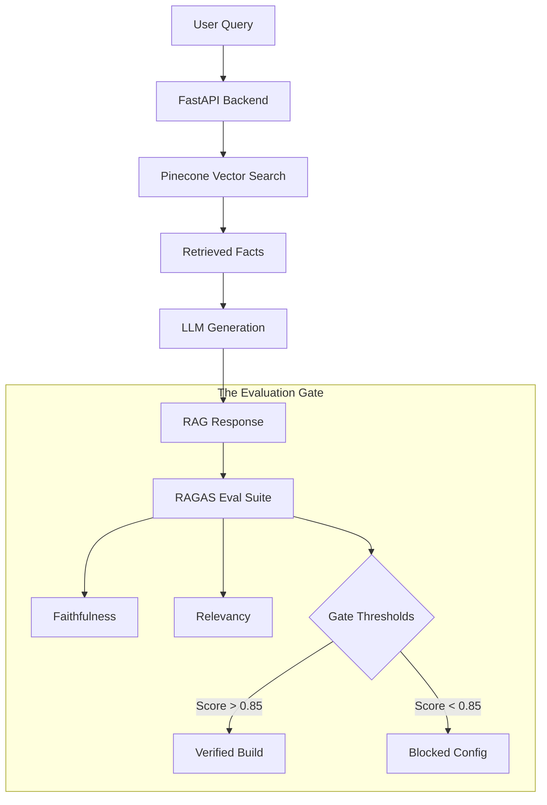

# Eval-Gated Observable RAG (Production-Ready)

This project provides an **Evaluation-Gated** RAG architecture designed to bridge the gap between raw LLM outputs and reliable business logic. It provides a **Zen-like, Observable, and Data-Driven** environment for AI Engineers to:

- 🎯 **Enforce Quality**: Quality standards are mandated through automated RAGAS (RAG Assessment) gating.
- 📊 **Monitor Performance**: Track real-time inference performance (TTFT, TPS, Cost).
- 🧪 **Benchmark**: Test model configurations against curated datasets before deployment.

---

## 🏗 The Workflow (What Happens Here?)

The system operates on a continuous feedback loop:

1.  **Retrieval**: Queries are converted into vectors and matched against the **Pinecone** index.
2.  **Generation**: **OpenRouter** streams a response from high-performance models (GPT-4, Claude 3, etc.).
3.  **Observability**: We track **Time To First Token (TTFT)** and **Tokens Per Second (TPS)** during the stream.
4.  **Evaluation**: The **Eval Engine** runs the **RAGAS** suite to calculate quality scores.
5.  **Gating**: If the `Faithfulness` score drops below `0.85`, the deployment status is flagged as **BLOCKED**.



---

## 📊 Metrics 101: How We Measure Success

To provide a complete picture of RAG performance, we split our observability into three critical domains: **Quality (The Gate)**, **SLA (Performance)**, and **Efficiency (Production)**.

### 1. Quality & Retrieval Metrics
These metrics analyze the relationship between the **Query**, the **Retrieved Context**, and the **Generated Answer**.

| Metric | Category | What it measures |
| :--- | :--- | :--- |
| **Faithfulness** | RAGAS | Are all facts in the answer derived *only* from the context? |
| **Answer Relevancy** | RAGAS | Does the answer actually address the user's intent? |
| **Context Precision** | RAGAS | Is the most relevant information ranked first in retrieval? |
| **Context Recall** | RAGAS | Does the retrieved data contain *all* the facts needed? |
| **Citation Coverage** | Custom | % of retrieved context chunks explicitly cited in the answer. |

---

### 2. SLA & Performance Metrics
These metrics measure the technical efficiency of the inference pipeline and ensure the system meets production SLAs.

- **TTFT (Time To First Token)**: The delay (ms) between the user's hit and the first character appearing.
  - *Goal*: `< 150ms`. Impacts perceived speed.
- **p50 Latency (Median)**: The average end-to-end response time for 50% of users.
- **p95 Latency (Tail)**: The maximum response time for 95% of users. Critical for catching performance bottlenecks.
- **TPS (Tokens Per Second)**: The "reading speed" of the stream.
  - *Goal*: `> 30 tps`.
- **Failure Rate**: The percentage of requests that result in a 5xx error or LLM timeout.

---

### 3. Production Efficiency
- **Cost Per Request**: Real-time estimation of USD cost based on token counts (Input + Output) and model pricing tiers.

---

## 🛠 The Tech Stack: Why These Tools?

To build an "Evaluation-Gated" system, we chose a stack that prioritizes **speed, reliability, and precision**.

| Tech | Choice | The "Why" |
| :--- | :--- | :--- |
| **Backend** | **FastAPI** | We need extreme performance and native **Async support** to handle streaming LLM responses and long-running evaluations without blocking the UI. |
| **Frontend** | **Next.js 15** | Provides a premium developer experience and high-density, real-time dashboards with **Turbopack** and **Tailwind CSS**. |
| **Vector DB** | **Pinecone** | A serverless, high-performance vector store. It allows us to scale retrieval to millions of documents while maintaining sub-100ms search latency. |
| **LLM Gateway** | **OpenRouter** | Provides a single unified API to switch between **GPT-4o, Claude 3, and Gemini** instantly. Essential for benchmarking which model handles a specific dataset best. |
| **Evaluation** | **RAGAS** | The industry standard for **LLM-as-a-judge**. It allows us to mathematically prove the quality of our RAG pipeline before deploying a single line to production. |
| **Orchestration** | **LangChain** | Acts as the **standardized interface** for RAGAS. We use it to wrap our OpenRouter models into a format that the evaluation suite can reliably judge. |

---

## 📂 Project Structure

| Directory | Responsibility |
| :--- | :--- |
| **`api/`** | **FastAPI Backend**. Handles LLM orchestration (OpenRouter), vector search (Pinecone), and the automated RAGAS evaluation engine. |
| **`data/`** | **Knowledge Base**. Storage for raw text files and benchmarking datasets used for automated quality testing. |
| **`pipelines/`** | **Data Engineering**. Logic for document ingestion, chunking, embedding generation, and Pinecone record indexing. |
| **`web/`** | **Next.js Frontend**. A high-density observability dashboard for monitoring live inference, trace logs, and production deployment gates. |

---

## 🚀 Getting Started

### 1. Environment
Ensure your `.env` contains:
```env
OPENROUTER_API_KEY=...
PINECONE_API_KEY=...
PINECONE_INDEX=evalgatedrag
```

### 2. Launch Services
```bash
# Backend (Port 8000)
cd api && python main.py

# Frontend (Port 3000)
cd web && npm run dev
```

### 3. Usage & Testing
- **Live Inference**: `POST http://localhost:8000/query` with payload `{"query": "..."}`.
- **Evaluation Gate**: Triggered via `EvalEngine.run_evaluation(test_queries)` against the `api/test_data.json` benchmark set.

---

## 📜 License
MIT License. Created for AI Professionals.
