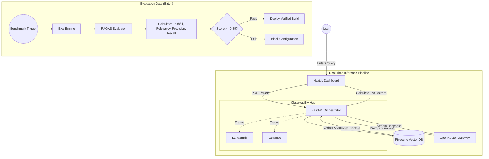

# Eval-Gated Observable RAG (Production-Ready)

This project provides an **Evaluation-Gated** RAG architecture designed to bridge the gap between raw LLM outputs and reliable business logic. It provides a **Zen-like, Observable, and Data-Driven** environment for AI Engineers to:

- 🎯 **Enforce Quality**: Quality standards are mandated through automated RAGAS (RAG Assessment) gating.
- 📊 **Monitor Performance**: Track real-time inference performance (TTFT, TPS, Cost).
- 🧪 **Benchmark**: Test model configurations against curated datasets before deployment.
- 🔗 **Observable Traces**: Dual support for LangChain/LangSmith and Langfuse for full execution visibility.

---

## 🏗 The Workflow (What Happens Here?)

The system operates on a continuous feedback loop:

1.  **Retrieval**: Queries are converted into vectors and matched against the **Pinecone** index.
2.  **Generation**: **OpenRouter** streams a response from high-performance models (GPT-4, Claude 3, etc.).
3.  **Observability**: We track **Time To First Token (TTFT)** and **Tokens Per Second (TPS)** during the stream.
4.  **Evaluation**: The **Eval Engine** runs the **RAGAS** suite to calculate quality scores.
5.  **Gating**: If the `Faithfulness` score drops below `0.85`, the deployment status is flagged as **BLOCKED**.



---

## 🛠️ The Tech Stack

| Tech | Choice | The "Why" |
| :--- | :--- | :--- |
| **Backend** | **FastAPI** | High-performance, native Async support for streaming LLM responses and RAGAS evaluations. |
| **Frontend** | **Next.js 16 / React 19** | A state-of-the-art developer experience with high-density, real-time dashboards and Framer Motion animations. |
| **Vector DB** | **Pinecone** | **Semantic Memory**. Stores chunks of the knowledge base as high-dimensional vectors for context retrieval. |
| **LLM Gateway** | **OpenRouter** | A unified API to switch between **GPT-4o, Claude 3.5, and Gemini** for both inference and evaluation. |
| **Evaluation** | **RAGAS** | The industry standard for **LLM-as-a-judge**, mathematically proving RAG quality. |
| **Observability** | **LangSmith / Langfuse / Opik** | **Triple-Trace Support**. Choose between LangChain, Langfuse, or Opik for tracing, metrics, and quality feedback. |

---

## 📈 Metrics 101: How We Measure Success

### 1. Session Inference [Live Metrics]
These SLA and performance metrics are calculated **on-the-fly** to measure technical efficiency.

- **TTFT (Time To First Token)**: *How fast does the AI start typing?* (Lower is better).
- **Throughput (TPS)**: *Tokens Per Second*. (Higher is better).
- **Cost/Req**: *How much money did this single question cost?*
- **Global p95 Latency**: *In the worst-case scenario, how slow is the app for 95% of users?*
- **Citation Coverage**: *Did the AI actually show its work?* (Percentage of retrieved context quoted).

### 2. Quality Benchmarking [Batch Metrics]
These deep evaluation metrics are powered by **RAGAS** and run asynchronously as a **Deployment Gate**.

| Metric | In Plain English | What it means for the User |
| :--- | :--- | :--- |
| **Faithful** | *Did the AI hallucinate?* | Ensures the AI only uses facts found in your Knowledge Base. |
| **Relevance** | *Did the AI answer the actual question?* | Prevents off-topic or generic, unhelpful responses. |
| **Precision** | *Did we find the right docs immediately?* | Ensures the database surfaces the *best* info at the top. |
| **Recall** | *Did we miss any important documents?* | Ensures the AI has all the puzzle pieces for a complete answer. |

---

## 🚀 Getting Started

### 1. Prerequisites
- Python 3.10+
- Node.js 20+

### 2. Environment Configuration
Create a `.env` file in the root directory:

```env
# Required API Keys
OPENROUTER_API_KEY=your_openrouter_key
PINECONE_API_KEY=your_pinecone_key
PINECONE_INDEX=evalgatedrag

# Tracing - LangSmith
LANGCHAIN_TRACING_V2=true
LANGCHAIN_API_KEY=your_langsmith_key
LANGCHAIN_PROJECT=eval-gated-rag

# Tracing - Langfuse
LANGFUSE_PUBLIC_KEY=your_langfuse_public_key
LANGFUSE_SECRET_KEY=your_langfuse_secret_key
LANGFUSE_HOST=https://cloud.langfuse.com

# Model Settings
DEFAULT_MODEL=openai/gpt-4o-mini
EVAL_MODEL=openai/gpt-4o-mini
EMBEDDING_MODEL=openai/text-embedding-3-small
```

### 3. Launch the Backend
```bash
cd api
python -m venv venv
source venv/bin/activate  # On Windows: venv\Scripts\activate
pip install -r requirements.txt
python main.py
```

### 4. Launch the Frontend
```bash
cd web
npm install
npm run dev
```

---

## 📂 Project Structure

| Directory | Responsibility |
| :--- | :--- |
| **`api/`** | **FastAPI Backend**. (Orchestration, Retrieval, RAGAS Eval Engine). |
| **`data/`** | **Knowledge Base**. (Raw text files and benchmark datasets). |
| **`pipelines/`** | **Data Engineering**. (Ingestion, chunking, and Pinecone indexing). |
| **`web/`** | **Next.js Frontend**. (Observability dashboard & deployment gate). |

---

## 🔍 Deep-Dive: Observability Hub

This project implements a **Triple-Orchestrator** system for full tracing visibility. You can toggle between these providers directly in the UI:

- **LangChain / LangSmith**: Provides deep component-level traces for LLM chains.
- **Langfuse**: Provides an alternative, product-focused observability dashboard with built-in evaluation tracking.
- **Opik (Comet)**: Our **Experimentation Engine**. Focused on multi-run comparisons, feedback loops, and RAGAS score correlation.

### 🟣 Why Opik? (Comet Integration)
While LangSmith and Langfuse provide excellent tracing, **Opik** is used here as a high-velocity **Experimentation Engine**:
- **Consolidated Dashboard**: View RAGAS quality scores directly alongside the raw LLM traces in a single view.
- **Feedback Signatures**: Opik simplifies the process of attaching quality labels to traces, making it easier to identify failure modes (e.g., "Why was this specific answer unfaithful?").
- **Developer-Centric**: Provides an open-source, flexible interface for monitoring nested RAG pipelines without proprietary lock-in.

### 📊 Metrics Handled by Opik
In this project, Opik serves as the primary data-sink for:
1.  **Inference Performance**: Captures **TTFT** (Time to First Token), **TPS** (Throughput), and **Total Latency**.
2.  **Resource Utilization**: Tracks **Input/Output Tokens** and calculates the **Estimated Cost** per request.
3.  **Quality Feedback**: RAGAS scores (Faithfulness, Relevancy, Precision, Recall) are logged into Opik as **Feedback Tags**, enabling you to filter and sort your execution history by quality metrics.

---

> [!TIP]
> Use the **LANGCHAIN**, **LANGFUSE**, or **OPIK** toggle in the dashboard command bar to switch tracing providers in real-time before running a query.

---

## 🗄️ Knowledge Base & Pinecone

### What is Pinecone storing?
Pinecone acts as the **Semantic Memory** for this project. It specifically stores:
- **Vector Embeddings**: Mathematical representations of text chunks from your knowledge base (located in `data/sample_kb.txt`).
- **Metadata**: Each vector is paired with the original raw text chunk, allowing the API to "retrieve" the exact text to feed into the LLM prompt.

### Why use Pinecone?
Standard databases query for exact matches. Pinecone queries for **meaning**. If a user asks a question about *"deployment rules"*, Pinecone will find chunks discussing *"evaluation gates"* and *"production thresholds"* even if the exact words don't match.

---

## 🏗️ Ingestion Pipeline (Adding Data)

To update the knowledge base or add new documents:

1. Place your `.txt` files in the `data/` directory.
2. Run the ingestion script:
   ```bash
   cd pipelines
   python ingest_documents.py
   ```
This script will:
- Read your files and chunk them (500 characters with 50-character overlap).
- Generate embeddings using the `EMBEDDING_MODEL` via OpenRouter.
- Upsert the vectors and their corresponding text into your Pinecone index.

---

---

## 📜 License
MIT License. Created for AI Professionals.
